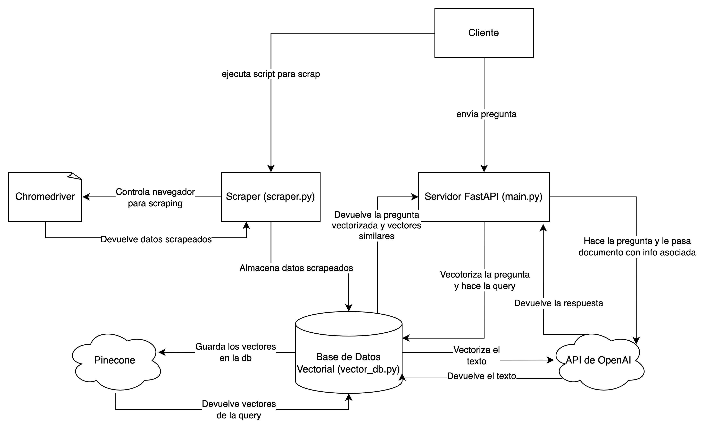

# Chatbot-Promptior

Asistente chatbot que usa la arquitectura RAG para responder preguntas sobre el contenido del sitio web de Promptior, basándose en la librería LangChain.

## Ejecutar Localmente

Siga estos pasos para ejecutar la aplicación en su entorno local.

### Configuración de Variables de Entorno

1. Cree un archivo `.env` en el directorio raíz del proyecto con sus propias claves de API y configuraciones. Ejemplo de contenido para `.env`:

    ```
    OPENAI_API_KEY=<tu_clave_api_openai>
    WCS_DEMO_URL=<tu_url_demo_weaviate>
    WCS_DEMO_RO_KEY=<tu_clave_lectura_weaviate>
    PINECONE_API_KEY=<tu_clave_api_pinecone>
    PINECONE_INDEX_NAME=<nombre_de_tu_indice_pinecone>
    CHROMEDRIVER_PATH=<tu_ruta_al_chromedriver>
    BASE_URL=<tu_url_base>
    LANGCHAIN_TRACING_V2=<verdadero_o_falso>
    LANGCHAIN_API_KEY=<tu_clave_api_langchain>
    ```

   Asegúrese de reemplazar los valores de ejemplo con sus propios datos.

### Preparar el Entorno

2. Cree un entorno virtual para el proyecto. Puede usar `conda` o `venv`:

    Con `venv`:

    ```sh
    python3 -m venv venv
    source venv/bin/activate
    ```

    Con `conda`:

    ```sh
    conda create --name mi_entorno python=3.9
    conda activate mi_entorno
    ```

### Instalar Dependencias

3. Instale todas las dependencias del proyecto utilizando `pip`:

    ```sh
    pip install -r requirements.txt
    ```

### Población de la Base de Datos Vectorial

4. Antes de ejecutar la aplicación, necesitará poblar su base de datos vectorial ejecutando el script `scraper.py`. Asegúrese de que este script apunte a la página web correcta de la cual desea extraer datos.

    ```sh
    python scraper.py
    ```

### Ejecución del Servidor

5. Una vez que haya configurado todo y poblado la base de datos, puede iniciar el servidor ejecutando:

    ```sh
    langchain serve
    ```

   Esto iniciará la aplicación en su máquina local, haciéndola accesible a través de `localhost` en el puerto definido por su aplicación FastAPI.

### Notas Adicionales

- No olvide activar su entorno virtual cada vez que trabaje en el proyecto.
- Asegúrese de que todas las claves de API y credenciales sensibles estén seguras y no se compartan públicamente.


---

El chatbot de Promptior está alojado en AWS y es accesible mediante la siguiente URL:

```
copilo-publi-ijdvnhhujh7w-1371450901.us-east-2.elb.amazonaws.com/ask
```

Para ejecutar una consulta a este servicio, puede utilizar tanto Postman como cURL. A continuación, se muestran las instrucciones para ambos métodos:

### Postman

1. Abra Postman y cree una nueva solicitud.
2. Establezca el método de la solicitud en `POST`.
3. Ingrese la URL del servicio alojado en AWS.
4. En la sección `Body` de la solicitud, seleccione `raw` y luego elija `JSON` como formato.
5. Ingrese el siguiente JSON en el cuerpo de la solicitud:

    ```json
    {
        "question": "Cuándo fue fundada la empresa?"
    }
    ```

6. Haga clic en `Send` para enviar la solicitud.

### cURL

Para realizar la misma solicitud usando cURL, puede usar el siguiente comando en su terminal o línea de comandos:

```sh
curl -X POST "copilo-publi-ijdvnhhujh7w-1371450901.us-east-2.elb.amazonaws.com/ask" 
-H "Content-Type: application/json" 
-d "{\"question\":\"Cuándo fue fundada la empresa?\"}"
```

### Respuesta Esperada

Independientemente del método que elija, la respuesta esperada debería ser similar a la siguiente:

```json
{
    "response": "Promptior fue fundada en marzo de 2023 con la misión de democratizar y facilitar el acceso a la inteligencia artificial para personas y organizaciones en todo el mundo."
}
```

Esto le permitirá interactuar con el chatbot de Promptior alojado en AWS para obtener respuestas a sus preguntas sobre la empresa.
---


## Descripción General del Proyecto

Este proyecto implementa un chatbot inteligente capaz de responder preguntas basándose en información relevante extraída de una página web específica. La solución integra scraping de datos, procesamiento y vectorización de texto, y búsqueda de similitudes en una base de datos vectorial.
Para realizar el proyecto, dado que queríamos usar una arquitectura RAG, partí por hacerme un diagrama con el flujo sobre cómo sería la estructura para abordar el proyecto. El flujo inicial era: el usuario hace una pregunta, luego pasaría a un script que recibiera esa pregunta, luego haga una búsqueda en nuestra biblioteca con la información relevante y esa biblioteca devuelva documentos relevantes a la pregunta inicial. Luego de esto, pasaríamos la pregunta en conjunto con los documentos al LLM para que genere una respuesta explícita.
Así fue como partí por crear mi environment e inicializar mi app con LangChain. Una vez creada mi aplicación, empecé por crear mi propio scraper. Dado que nunca había usado herramientas de este estilo, decidí indagar y ponerme a hacer mi propio script, quise que el scraper sea simple y lo más genérico posible para que no solo funcionara con la URL de prompter sino con cualquier otra webapp. Una vez culminado el scraper, pasé a la base de datos.
Acá se hizo evidente la necesidad de una base de datos vectorial en lugar de una relacional o lo que sea. Ya que nuestra aplicación requiere realizar búsquedas basadas en similitud semántica y no solo coincidencias exactas. Las bases de datos vectoriales nos permiten manejar datos de alta dimensionalidad y así poder hacer búsquedas por proximidad en espacios vectoriales eficientemente. Así fue que opté por Pinecone porque ya había trabajado con ella anteriormente. A su vez, implementé una función para convertir el texto en vectores embebidos y mandarle a la db la data scrapeada ya en formato de vectores. En fin, creé 3 funciones, una para subir los vectores a la nube, otra para hacer las queries y otra para embeber el texto.

Una vez realizados los archivos de scraping y la conexión con la bdd establecida, me puse a trabajar con las pegadas a la API de OpenAI para usar el LLM. Decidí optar por el modelo 3.5 turbo de OpenAI porque ya había trabajado anteriormente y es el menos costoso. Aquí establecí el flow y creé funciones con FastAPI para hacer las pegadas mandando las preguntas y establecer la conexión cliente/servidor.

Una vez que verifiqué que funcionara todo bien, decidí hacer el deployment con AWS mediante el AWS Copilot CLI usando el comando proporcionado por la doc de LangServe.


### Lógica de Implementación

La aplicación se construye alrededor de tres componentes principales:

1. `scraper.py`: Se encarga de traer los datos de un sitio web específico utilizando BeautifulSoup y Selenium, con la ayuda de ChromeDriver para interactuar con el navegador Chrome.

2. `vector_db.py`: Administra la comunicación con la base de datos vectorial Pinecone. Incluye funciones para vectorizar texto utilizando el modelo de OpenAI, insertar datos vectorizados y buscar los vectores más similares a una consulta dada.

3. `main.py` (FastAPI Server): Este es el núcleo de la aplicación, donde se define la API del Chatbot. Recibe preguntas, interactúa con el módulo `vector_db.py` para obtener datos relevantes y utiliza OpenAI para generar respuestas.

### Desafíos y Soluciones

- **Integración de diferentes tecnologías**: La implementación requirió una integración fluida de diversas herramientas como FastAPI, OpenAI, Pinecone, BeautifulSoup y Selenium. La solución fue estructurar el código en módulos independientes con responsabilidades claras.

- **Vectorización de texto y búsqueda de similitudes**: Se utilizó el modelo de OpenAI para vectorizar texto y Pinecone para las operaciones de búsqueda, aprovechando sus capacidades de similitud vectorial.

## Funcionamiento de Main.py

El servidor FastAPI define dos rutas principales:

- Un endpoint de verificación (`/`), que simplemente devuelve el estado de funcionamiento del servidor.

- El endpoint `/ask`, que acepta preguntas y realiza el siguiente proceso:
  1. Vectoriza la pregunta recibida.
  2. Consulta la base de datos vectorial para encontrar información relevante.
  3. Genera una respuesta utilizando el modelo GPT-3.5-turbo de OpenAI, a la cual le enviamos la pregunta en conjunto a los documentos recuperados.

Si el modelo de OpenAI no puede generar una respuesta, se devuelve un mensaje de error estándar.

## Diagrama de Componentes

